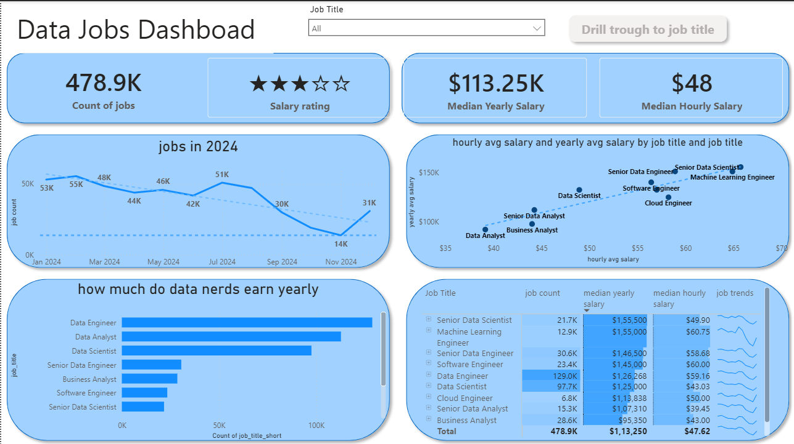
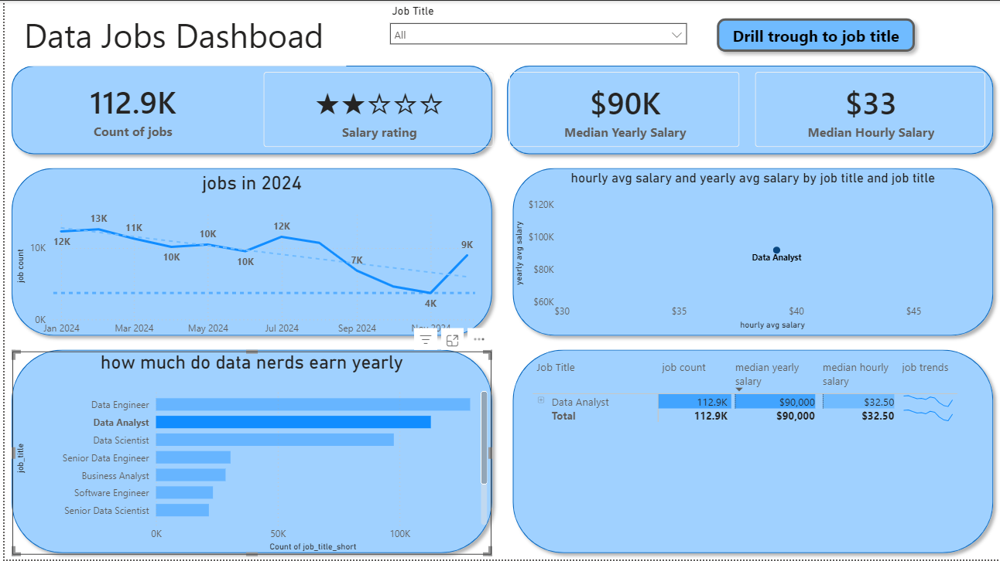
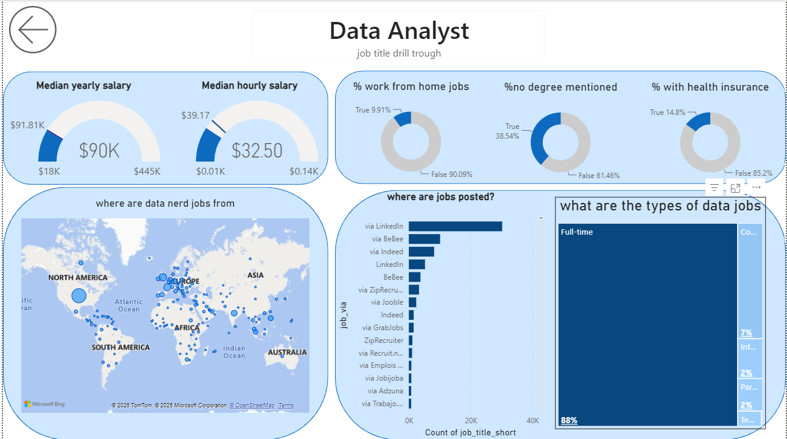
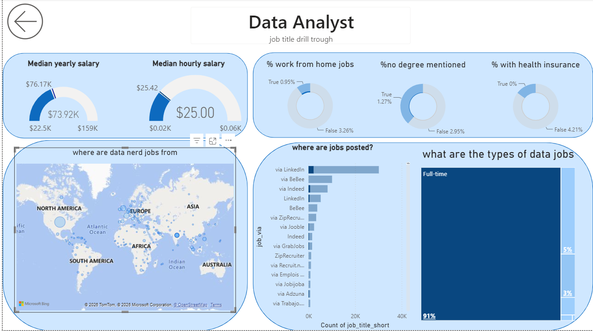

# 📊 Data Jobs Dashboard — Power BI 

An interactive **Power BI dashboard** built to analyze **478K+ data job postings**, uncovering trends in job demand, salaries, remote-work opportunities, job requirements, and geographic distribution.

The project transforms a large job-market dataset into **business-oriented insights** that can support job-market research and hiring-related decision-making.

---

## 🎯 Project Objective

The objective of this project was to explore the data-job market and answer questions such as:

* Which data roles have the highest demand?
* How do salaries vary across different job titles?
* Which roles offer the most remote-work opportunities?
* Where are data-related jobs concentrated geographically?
* How do job postings change over time?
* What percentage of jobs mention degree requirements?
* Which job schedules are most common?
* Which job sources contribute the most postings?

---

## 📁 Dataset

The dashboard analyzes a dataset containing **478K+ job postings** with information related to:

* Job titles and job categories
* Company and job location
* Salary information
* Remote-work availability
* Job schedule type
* Degree requirements
* Health insurance availability
* Job posting date
* Job source/platform
* Country
* Job application information

---

## 🛠️ Tools & Technologies

| Tool                | Purpose                                 |
| ------------------- | --------------------------------------- |
| **Power BI**        | Dashboard development and visualization |
| **Power Query**     | Data cleaning and transformation        |
| **DAX**             | Measures, calculations, and analysis    |
| **Microsoft Excel** | Supporting data preparation             |

---

## 🔄 Data Preparation

The dataset was prepared and transformed using **Power Query** before being used in the dashboard.

Key preparation tasks included:

* Data cleaning
* Data transformation
* Removing inconsistencies
* Standardizing data formats
* Preparing salary-related fields
* Structuring job-posting dates
* Preparing categorical fields for analysis

---

## 📊 Dashboard Overview

The project consists of **two interactive Power BI dashboard pages**, designed to provide both high-level market insights and more detailed job analysis.

### 📌 Dashboard — Page 1

This page provides an overview of the data-job market, including key metrics and visualizations related to:

* Job demand
* Salary trends
* Job titles
* Geographic distribution
* Remote-work opportunities
* Job posting trends

#### Screenshot

> 

📷 DASHBOARD SCREENSHOT — PAGE 1

---

### 📌 Dashboard — Page 2

The second page provides more detailed analysis of job characteristics and allows users to explore additional dimensions of the dataset.

Analysis includes areas such as:

* Job-title analysis
* Salary information
* Remote-work availability
* Degree requirements
* Health insurance
* Job schedule types
* Job sources
* Geographic information

#### Screenshot

📷 DASHBOARD SCREENSHOT — PAGE 2

## 🔍 Interactive Features

The dashboard uses Power BI's interactive capabilities to allow users to explore the dataset dynamically.

Features include:

* Interactive filters
* KPI cards
* Drill-through functionality
* Job-title filtering
* Geographic visualizations
* Salary analysis
* Time-based analysis
* Interactive charts and graphs

---

## 💼 Business Questions

The dashboard was designed around questions relevant to **job seekers, recruiters, and hiring-related decision-making**, including:

> Which data roles are experiencing the strongest demand?

> Which roles provide better remote-work opportunities?

> How does compensation differ between data-related roles?

> Which regions have the strongest concentration of opportunities?

> What requirements and benefits are commonly mentioned in job postings?

---

## 💡 Key Project Highlights

* Analyzed **478K+ job postings**
* Built a multi-page interactive Power BI dashboard
* Used **Power Query** for data cleaning and transformation
* Used **DAX** for analytical calculations
* Implemented interactive filtering and drill-through functionality
* Created KPI and salary analysis
* Analyzed remote-work opportunities
* Performed geographic and job-title analysis
* Transformed raw job-market data into business-oriented insights

---

## 🧠 Skills Demonstrated

* Data Cleaning
* Data Transformation
* Data Modeling
* DAX
* Power Query
* Data Visualization
* Business Intelligence
* KPI Development
* Dashboard Design
* Exploratory Data Analysis
* Business-Oriented Data Analysis
* Insight Generation

## 🚀 How to View the Dashboard

This project is provided as a **Power BI `.pbix` file**.

### Requirements

* **Microsoft Power BI Desktop**

### Steps

1. Download the `.pbix` file from this repository.
2. Install/open **Power BI Desktop**.
3. Open `dash.pbix`.
4. Interact with the dashboard pages, filters, visualizations, and drill-through features.

> **Note:** A Power BI Service/public dashboard link is not provided. The project is intended to be viewed locally using Power BI Desktop.

---

## 👤 Author

### Vinayak Mishra

**B.Tech. — Computer Science & Engineering (Data Science)**

📧 **Email:** [vinayakmishradata@gmail.com](mailto:vinayakmishradata@gmail.com)

🔗 **LinkedIn:** [Vinayak Mishra](https://www.linkedin.com/in/vinayak-mishra-114639315/)

💻 **GitHub:** [vinayak-mishra-610](https://github.com/vinayak-mishra-610)

---

## 🙏 Acknowledgement

Special thanks to **Luke** for providing the dataset and guidance that supported the development of this project.

---

## 📜 License

This project is intended for **educational and portfolio purposes**.
